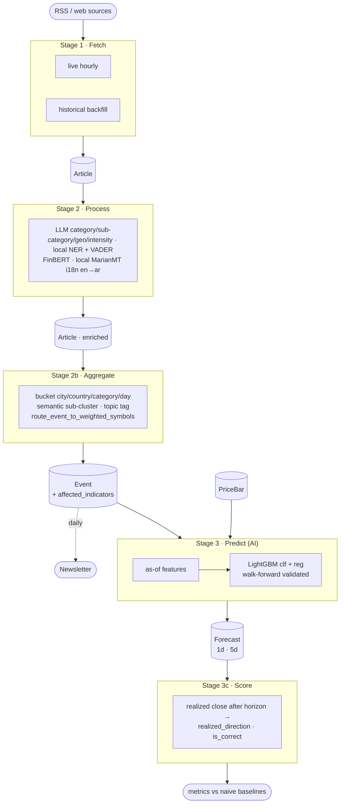

# Event Horizon — Documentation

A real-time global event-intelligence platform that ingests news + market/geophysical
streams, reconstructs them into **events** and **topics**, and predicts the
**direction & magnitude of economic indicators from news data**.

This `docs/` set explains the system end to end. For day-to-day coding conventions,
recipes, and the file map, see [`../CLAUDE.md`](../CLAUDE.md) — this folder is the
*conceptual* companion to that *operational* guide.

## Contents

| Doc | What it covers |
|-----|----------------|
| [architecture.md](architecture.md) | Stack, Docker services, queues, data flow, storage |
| [pipeline.md](pipeline.md) | Every phase of the system, in order, with inputs/outputs |
| [forecasting.md](forecasting.md) | The news → economic-indicator prediction subsystem (the redesign) |
| [data-model.md](data-model.md) | Core MongoDB collections and their key fields |
| [symbols.md](symbols.md) | The `MarketSymbol` config model — curating fetched/forecast/UI symbols |
| [operations.md](operations.md) | Admin dashboard, fan-out pipeline, configurationless bootstrap |

## The system in one picture



## Quick start

```bash
cp api/.env.example .env.app      # fill in SECRET_KEY etc.; LLM works out of the box
docker compose up                 # everything
cd api && python manage.py migrate
python manage.py run_task pipeline_tick_task --sync   # run one pipeline tick in-process
```

> **LLM**: free-tier cloud providers (`GROQ_API_KEYS`, `CEREBRAS_API_KEYS`) lead every route, with OpenRouter (`OPENROUTER_API_KEYS`) as the mid fallback and self-hosted Ollama (no API key; set `OLLAMA_BASE_URL` if it runs elsewhere, default `http://localhost:11434`) as the last resort. The LLM's job is narrower than it looks — entities, sentiment, Arabic translation, topic tagging, and event routing all run on local models instead. See [architecture.md → LLM providers & routing](architecture.md#llm-providers--routing).

See [`../CLAUDE.md` → Dev Commands](../CLAUDE.md) for the full command list.
</content>
</invoke>
