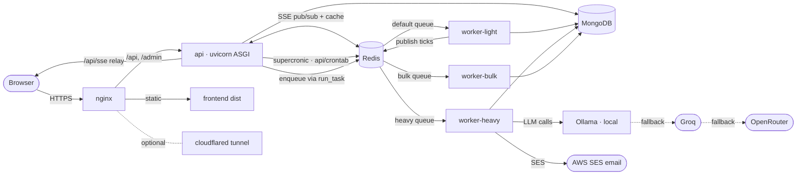
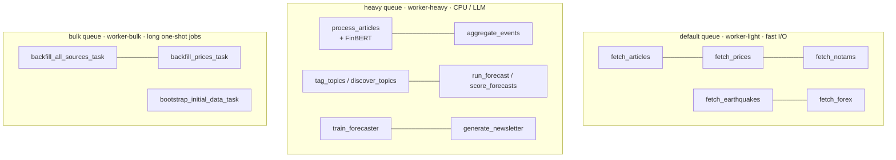
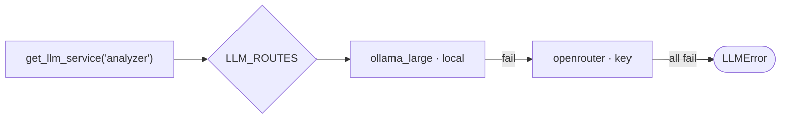

# Architecture

## Stack

| Layer | Technology |
|-------|------------|
| Backend | Django 6 + django-mongodb-backend |
| Storage | MongoDB 8 |
| Task queue | django-rq + Redis — three queues: `default` (light I/O), `heavy` (NLP/LLM), `bulk` (long one-shot jobs) |
| Scheduling | supercronic + `api/crontab` → `manage.py run_task` (runs in `api` container) |
| Ingestion | feedparser (RSS) + requests |
| NLP | LLM (entities · sentiment · category/sub-category · geocode) · sentence-transformers (clustering) · **FinBERT** (financial sentiment) · geonamescache |
| LLM | Multi-provider via `services/llm.py` — Ollama (default), Groq, Cerebras, OpenRouter; per-use-case routing + fallback chains (`settings.LLM_ROUTES`) |
| Forecasting | as-of feature engineering + **LightGBM** (optional dep) |
| Frontend | React 19 + Vite + react-router-dom + react-leaflet (TypeScript) |
| Real-time | Server-Sent Events over Redis pub/sub |
| Email | AWS SES (newsletter + double opt-in confirmation) |
| Serving | uvicorn (ASGI) + nginx reverse proxy |
| Containers | Docker Compose |

## Docker services

| Service | Role |
|---------|------|
| `frontend` | builds the Vite SPA, copies `dist/` |
| `nginx` | reverse proxy (80/443) |
| `cloudflared` | optional Cloudflare Tunnel |
| `api` | uvicorn ASGI + supercronic (`api/crontab`) |
| `worker-heavy` | `rqworker-pool heavy` — NLP / LLM tasks |
| `worker-light` | `rqworker-pool default` — fast I/O tasks |
| `worker-bulk` | `rqworker-pool bulk` — long one-shot jobs |
| `redis` | RQ broker + cache + SSE pub/sub |
| `mongo` | database (27017) |
| `static_data` | seeds static reference data (countries, airports, etc.) |

### Runtime topology



## Three-queue model

Work is split by cost, not by feature:

- **`default`** — fast I/O: article fetch, price/notam/earthquake/forex streams.
  Enqueued by dispatchers (e.g. `dispatch_fetch_articles`, `dispatch_fetch_prices`).
- **`heavy`** — anything CPU- or LLM-bound: `process_articles`, `aggregate_events`,
  topic tagging/discovery, FinBERT scoring, `run_forecast`, `score_forecasts`,
  `train_forecaster`, newsletter generation.
- **`bulk`** — long one-shot jobs: `backfill_all_sources_task`, `backfill_prices_task`,
  `bootstrap_initial_data_task`.

`enqueue(fn, queue='heavy', ...)` selects the queue. When `TASK_QUEUE_ENABLED=False`
(dev default) `enqueue()` calls the function **synchronously** — no Redis or worker
needed locally.



## Code layout (where the work happens)

```
api/
  core/        models (Source, Article, Event, Topic, PriceTick, …, Forecast) + admin + commands
  api/         DRF views + serializers (events, forecasts, newsletter)
  services/    stateless Python — no Django models
    tasks.py            all task functions (plain Python, no decorator)
    workflow.py         orchestrates process → aggregate → tag → route
    processing/         analyzer, cleaner, clustering, finbert
    forecasting/        features, buckets, routing, calibration, service, model, metrics
    streams/            prices (+ ^VIX), notam, earthquakes, forex
    topics/             matcher, scraper, dedup, sources/current_events
    newsletter/         generator, sender
  migrations/  centralized, mapped via MIGRATION_MODULES
ui/            React 19 + Vite SPA (TypeScript)
```

## Data flow & storage

1. **Ingestion** writes raw `Article` documents.
2. **Processing** enriches each `Article` in place (entities, sentiment ×2, category,
   sub-category, translations).
3. **Aggregation** rolls articles up into `Event` documents and attaches
   `affected_indicators`.
4. **Streams** write `PriceTick` / `NotamZone` / `NotamRecord` / `EarthquakeRecord`
   independently and publish to Redis SSE channels.
5. **Forecasting** reads `Event` + `PriceTick` (strictly as-of) and writes `Forecast`
   rows, later filling actuals during scoring.

All time-based filtering on MongoDB uses explicit datetime ranges (never `__date`),
and the forecasting subsystem enforces point-in-time (as-of) cuts everywhere — see
[forecasting.md](forecasting.md).

## Real-time (SSE)

`GET /api/sse/` is an async ASGI view subscribed to Redis channels (`sse:prices`,
`sse:notams`, `sse:earthquakes`). Each stream task publishes after saving; the browser
`useSSE` hook auto-reconnects and dispatches per event type (`price_tick`,
`notam_update`, `earthquake_update`).

## LLM providers & routing

All LLM calls go through `get_llm_service(role)` in `services/llm.py`. There is **no
single backend switch** — instead, providers are configured independently and each
use-case (*role*) is routed to one provider or an **ordered fallback chain**.

**Providers:**

| Provider | Endpoint | Key required | Notes |
|----------|----------|--------------|-------|
| `ollama_small` | `OLLAMA_BASE_URL` (default `http://localhost:11434`) | None | `qwen3:4b` — fast, simple tasks |
| `ollama_medium` | same | None | `qwen3:8b` — default for most roles |
| `ollama_large` | same | None | `qwen3:14b` — complex analysis & newsletters |
| `groq` | `https://api.groq.com/openai/v1` | `GROQ_API_KEYS` | Free tier. Only active when keys are set. |
| `cerebras` | `https://api.cerebras.ai/v1` | `CEREBRAS_API_KEYS` | Free tier. Only active when keys are set. |
| `openrouter` | `https://openrouter.ai/api/v1` | `OPENROUTER_API_KEYS` | Fallback. Comma-separated keys rotate round-robin. |

Model overrides: set `OLLAMA_MODEL_SMALL`, `OLLAMA_MODEL_MEDIUM`, `OLLAMA_MODEL_LARGE` in `.env`.

**Default `LLM_ROUTES` (in `settings/base.py`):**

| Role | Chain |
|------|-------|
| `default` | ollama_medium → groq → openrouter |
| `analyzer` | ollama_large → openrouter |
| `analyzer_lite` | ollama_medium → groq → openrouter |
| `newsletter` | ollama_large → openrouter |
| `scoring` | ollama_small → groq → cerebras → openrouter |
| `historical` | ollama_small → groq → cerebras → openrouter |
| `topics` | ollama_medium → groq → openrouter |
| `routing` | ollama_small → groq → cerebras → openrouter |

**Config split:**
- **`.env`** — per-provider settings only (keys / base URLs / model names). See
  [`api/.env.example`](../api/.env.example).
- **`settings.LLM_ROUTES`** (a dict in `settings/base.py`) — the who-uses-what routing.
  Override per role as needed.

A multi-provider route returns a `FallbackLLMService` that tries each backend in order,
catching `LLMError`, until one succeeds. Unconfigured providers (no base URL / key) are
skipped automatically. Test a route with `python manage.py test_llm --role <role>`.


</content>
