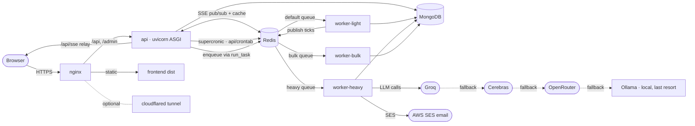
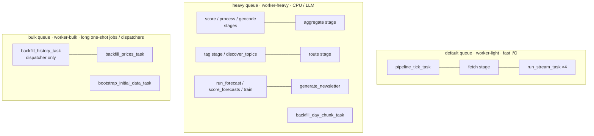
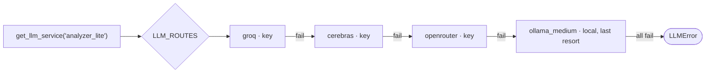

# Architecture

## Stack

| Layer | Technology |
|-------|------------|
| Backend | Django 6 + django-mongodb-backend |
| Storage | MongoDB 8 |
| Task queue | Celery + Redis — three queues: `default` (light I/O), `heavy` (NLP/LLM), `bulk` (long one-shot jobs) |
| Scheduling | supercronic + `api/crontab` → `manage.py run_task` (runs in `api` container) |
| Ingestion | feedparser (RSS) + requests |
| NLP | LLM (category/sub-category · geo naming · intensity) · local NER (`dslim/bert-base-NER`, entities) · VADER (sentiment, rule-based) · sentence-transformers (clustering + topic matching) · **FinBERT** (financial sentiment) · MarianMT (Arabic translation) · geonamescache (geocode) |
| LLM | Multi-provider via `services/llm/` — Groq/Cerebras/OpenRouter (free-tier cloud, primary) with Ollama (local, CPU) as last-resort fallback; per-use-case routing + fallback chains (`settings.LLM_ROUTES`) |
| Forecasting | as-of feature engineering + **LightGBM** (optional dep) |
| Frontend | React 19 + Vite + react-router-dom + react-leaflet (TypeScript) |
| Real-time | Server-Sent Events over Redis pub/sub |
| Email | AWS SES (newsletter + double opt-in confirmation) |
| Serving | uvicorn (ASGI) + nginx reverse proxy |
| Containers | Docker Compose |

## Docker services

| Service | Role |
|---------|------|
| `frontend` | builds the Vite SPA, copies `dist/` |
| `nginx` | reverse proxy (80/443) |
| `cloudflared` | optional Cloudflare Tunnel |
| `api` | uvicorn ASGI + supercronic (`api/crontab`) |
| `worker-heavy` | `celery -A app worker -Q heavy` — NLP / LLM tasks |
| `worker-light` | `celery -A app worker -Q default` — fast I/O tasks |
| `worker-bulk` | `celery -A app worker -Q bulk` — long one-shot jobs |
| `redis` | Celery broker + cache + SSE pub/sub |
| `mongo` | database (27017) |
| `static_data` | seeds static reference data (countries, airports, etc.) |

### Runtime topology



## Three-queue model

Work is split by cost, not by feature. The pipeline itself is a **stage
registry** (`services/stages.py`) — every stage declares which of these three
queues it runs on; see [pipeline.md](pipeline.md) for the full stage list.

- **`default`** — fast I/O: the `fetch` pipeline stage, `pipeline_tick_task`
  itself, `dispatch_stage_task`, price/notam/earthquake/forex streams
  (`run_stream_task`).
- **`heavy`** — anything CPU- or LLM-bound: the `score`/`process`/`geocode`/
  `aggregate`/`tag`/`route` pipeline stages (via `run_stage_chunk_task`),
  `discover_topics_task`, `refresh_topics_task`, `run_forecast_task`,
  `score_forecasts_task`, `train_forecast_model_task`, `generate_newsletter_task`,
  `backfill_day_chunk_task` (one day × a few sources — fetch, save, process,
  bounded to the queue's ~10min default time limit).
- **`bulk`** — long one-shot jobs / pure dispatchers: `backfill_history_task`
  (dispatches `backfill_day_chunk_task` onto `heavy`, does no fetching itself),
  `backfill_prices_task`, `bootstrap_initial_data_task`.

`enqueue(fn, queue='heavy', ...)` selects the queue. When `TASK_QUEUE_ENABLED=False`
(dev default) `enqueue()` calls the function **synchronously** — no Redis or worker
needed locally.



## Code layout (where the work happens)

```
api/
  core/        models (Source, Article, Event, Topic, PriceTick, …, Forecast) + admin + commands
  api/         DRF views + serializers (events, forecasts, newsletter)
  services/    stateless Python — no Django models
    stages.py           the pipeline stage registry — single source of truth for
                         selection/handling/chunking/cadence per stage
    tasks.py             all task functions (plain Python, no decorator); pipeline_tick_task
                         + run_stage_chunk_task execute every stage in stages.py
    workflow/            articles.py (fetch/process), events.py (aggregate + coverage),
                         topics.py (tag/discover/refresh)
    processing/         analyzer (LLM), ner (local), vader (local), finbert (local), cleaner, clustering
    translation/        local EN→AR (MarianMT)
    forecasting/        features, buckets, routing (deterministic), calibration, service, model, metrics
    routing/            thin wrapper persisting Event.affected_indicators from forecasting/routing.py
    streams/            prices (+ ^VIX), notam, earthquakes, forex — BaseStream.run() re-raises
                         fetch/save failures so a broken stream fails its TaskRun visibly
    topics/             matcher (EmbeddingTopicMatcher default/semantic, TopicMatcher keyword
                         fallback), scraper, dedup, sources/current_events
    newsletter/         generator, sender
  migrations/  centralized, mapped via MIGRATION_MODULES
  requirements-dev.txt  dev-only deps (ruff); ruff.toml — lint config (F + E9/W6 only)
ui/            React 19 + Vite SPA (TypeScript)
```

## Data flow & storage

1. **Ingestion** writes raw `Article` documents.
2. **Processing** enriches each `Article` in place: LLM (category, sub-category, geo,
   intensity, English title/summary), local NER (entities), local VADER + FinBERT
   (sentiment ×2), local MarianMT (Arabic translation).
3. **Aggregation** rolls articles up into `Event` documents and attaches
   `affected_indicators`.
4. **Streams** write `PriceTick` / `NotamZone` / `NotamRecord` / `EarthquakeRecord`
   independently and publish to Redis SSE channels.
5. **Forecasting** reads `Event` + `PriceTick` (strictly as-of) and writes `Forecast`
   rows, later filling actuals during scoring.

All time-based filtering on MongoDB uses explicit datetime ranges (never `__date`),
and the forecasting subsystem enforces point-in-time (as-of) cuts everywhere — see
[forecasting.md](forecasting.md).

## Real-time (SSE)

`GET /api/sse/` is an async ASGI view subscribed to Redis channels (`sse:prices`,
`sse:notams`, `sse:earthquakes`). Each stream task publishes after saving; the browser
`useSSE` hook auto-reconnects and dispatches per event type (`price_tick`,
`notam_update`, `earthquake_update`).

## LLM providers & routing

All LLM calls go through `get_llm_service(role)` in `services/llm/__init__.py`. There is
**no single backend switch** — instead, providers are configured independently and each
use-case (*role*) is routed to one provider or an **ordered fallback chain**. Free-tier
cloud providers lead every chain; local Ollama is always the last-resort fallback (it's
the only one with no rate limit, but it's slow on CPU-only hardware).

**Providers:**

| Provider | Endpoint | Key required | Notes |
|----------|----------|--------------|-------|
| `groq` | `https://api.groq.com/openai/v1` | `GROQ_API_KEYS` | Free tier, high headroom — leads most chains. |
| `cerebras` | `https://api.cerebras.ai/v1` | `CEREBRAS_API_KEYS` | Free tier, tiny 5 req/min quota — only *leads* the low-volume newsletter role. |
| `openrouter` | `https://openrouter.ai/api/v1` | `OPENROUTER_API_KEYS` | Mid fallback. Comma-separated keys rotate round-robin. |
| `ollama_small` | `OLLAMA_BASE_URL` (default `http://localhost:11434`) | None | `qwen3:4b` — last resort, fast/simple tasks |
| `ollama_medium` | same | None | `qwen3:8b` — last resort, default tier |
| `ollama_large` | same | None | `qwen3:14b` — last resort, complex analysis & newsletters |

Model overrides: set `OLLAMA_MODEL_SMALL`, `OLLAMA_MODEL_MEDIUM`, `OLLAMA_MODEL_LARGE` in `.env`.

**Default `LLM_ROUTES` (in `settings/base.py`):**

| Role | Chain | Used for |
|------|-------|----------|
| `default` | groq → cerebras → openrouter → ollama_medium | fallback for unlisted roles |
| `analyzer_lite` | groq → cerebras → openrouter → ollama_medium | article category/sub-category/geo/intensity + EN translation (entities/sentiment are local — see below) |
| `newsletter` | cerebras → openrouter → ollama_large | daily newsletter prose |
| `scoring` | groq → cerebras → openrouter → ollama_small | article importance rating |
| `historical` | groq → cerebras → openrouter → ollama_small | backfill importance rating |
| `topics` | groq → cerebras → openrouter → ollama_medium | topic description/keyword enrichment + discovery (tagging itself is local — see below) |
| `routing` | groq → cerebras → openrouter → ollama_small | unused by default (`FORECAST_ROUTER='rules'`); opt-in alternative to the deterministic router |

**Local-model replacements** (no LLM call at all): entities (`services/processing/ner.py`,
`dslim/bert-base-NER`), sentiment (`services/processing/vader.py`, VADER), Arabic
translation (`services/translation/`, MarianMT), event→topic tagging
(`services/topics/matcher.py::EmbeddingTopicMatcher`, sentence-transformer cosine
similarity), and event→symbol routing (`services/forecasting/routing.py`, deterministic
rules). See [CLAUDE.md → LLM routing](../CLAUDE.md) for the full rationale.

**Config split:**
- **`.env`** — per-provider settings only (keys / base URLs / model names). See
  [`api/.env.example`](../api/.env.example).
- **`settings.LLM_ROUTES`** (a dict in `settings/base.py`) — the who-uses-what routing.
  Override per role as needed.

A multi-provider route returns a `FallbackLLMService` that tries each backend in order,
catching `LLMError`, until one succeeds. Unconfigured providers (no base URL / key) are
skipped automatically. Test a route with `python manage.py test_llm --role <role>`.


</content>
