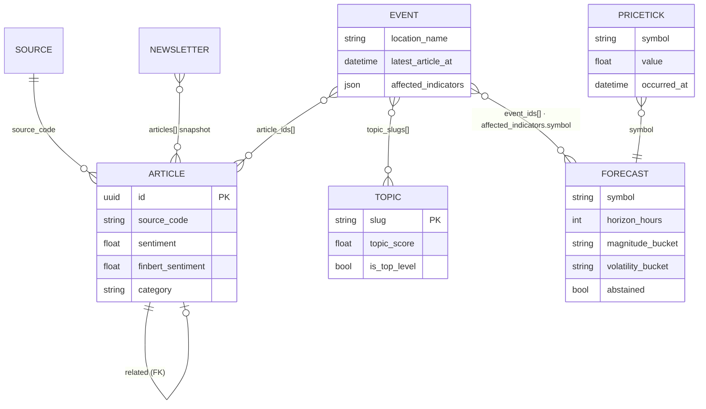
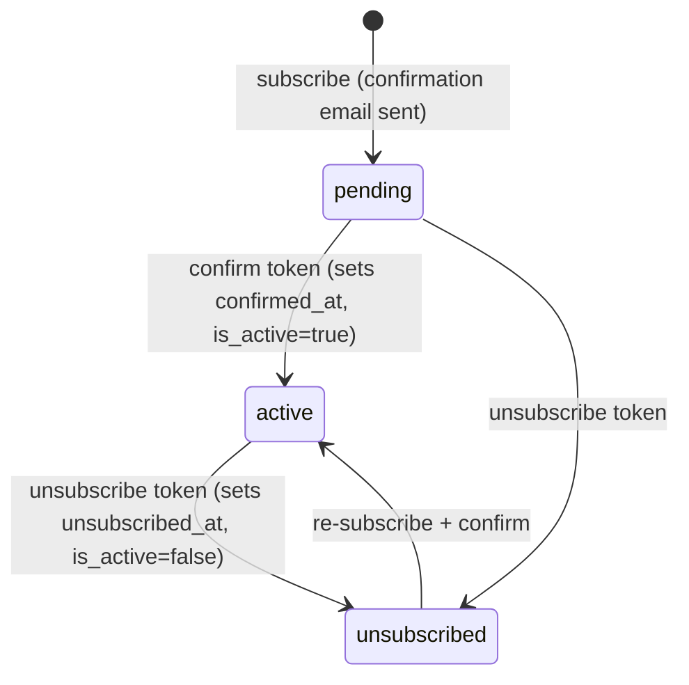

# Data model

All core models live in `api/core/models.py` and use `MongoManager` from
django-mongodb-backend. Migrations are centralized under `api/migrations/` and mapped
via `MIGRATION_MODULES`.

**Two MongoDB rules apply everywhere:**

| Rule | Wrong | Right |
|------|-------|-------|
| Never use the `__date` lookup | `filter(published_on__date=today)` | `filter(published_on__gte=start, published_on__lt=end)` |
| `Article.article_ids` holds **string** UUIDs | `filter(id__in=event.article_ids)` | `filter(id__in=[uuid.UUID(a) for a in event.article_ids])` |

Legend for the type column: `→` = enum/choices, `[]` = list, `{}` = dict/subdocument.

## Relationships

There are no hard foreign keys between the analytics collections (MongoDB) — links are
**logical**, made by string id-lists or shared keys (`source_code`, `symbol`,
`topic_slugs`). Solid lines below are id-list references; the dashed line is the only
real Django FK (`Article.related → Article`).

---

## Article

Raw news item from one source, enriched **in place** by the processing stage.

| Field | Type | Description |
|-------|------|-------------|
| `id` | UUID (PK) | Primary key, generated at fetch time |
| `source_code` | str(64) | Code of the originating `Source` |
| `source_type` | str → `SourceType` | website / api / rss / social / email / newsletter / database |
| `source_url` | URL(512) | Canonical item URL (dedupe key with code+type) |
| `author` / `author_slug` | str(100) | Byline + slug |
| `title` | str(200) | Headline |
| `content` | text | Body text |
| `published_on` | datetime | Publish timestamp (UTC); drives all as-of cuts |
| `related` | FK→self | Optional link to a related article |
| `entities` | `[]` | LLM-extracted entities `[{text, label}]` |
| `sentiment` | float \| null | LLM-extracted polarity [-1, 1] |
| `finbert_sentiment` | float \| null | **FinBERT** signed sentiment [-1, 1] — news-domain (new) |
| `location` | str(255) \| null | `City, Country` from LLM analysis |
| `event_intensity` | float \| null | LLM-rated newsworthiness/severity [0, 1] |
| `category` | str → `EventCategory` | Top-level category (rule/LLM) |
| `sub_category` | str(64) \| null | LLM sub-category within the top-level |
| `processed_on` | datetime \| null | Set when NLP processing completes |
| `banner_image_url` | URL(512) \| null | RSS media or OG-image fallback |
| `latitude` / `longitude` | float \| null | Geocoded coordinates |
| `translations` | `{}` | Per-language `{en:{...}, ar:{...}}` |
| `extra_data` | `{}` | Raw LLM payload etc. |
| `updated_on` / `created_on` | datetime | Audit timestamps |

**Indexes:** `created_on`, `source_code`, `author_slug`, `category`, `processed_on`,
`location`.

---

## Event

An aggregated real-world happening; **one event, many source articles**. Built by
`aggregate_events`.

| Field | Type | Description |
|-------|------|-------------|
| `title` | str(512) | Representative title |
| `content` | text | Aggregated/representative body |
| `category` | str → `EventCategory` | Default `general` |
| `location_name` | str(255) | Bucketing location |
| `latitude` / `longitude` | float \| null | Coordinates |
| `started_at` | datetime | Timestamp of the **earliest** article |
| `latest_article_at` | datetime \| null | **= max(`published_on`)** over members — the **event-time** used for all as-of forecasting cuts (not the day bucket) ★new |
| `article_count` | int | Number of constituent articles |
| `avg_sentiment` | float \| null | Mean article sentiment |
| `avg_finbert_sentiment` | float \| null | FinBERT mean over articles ★new |
| `avg_intensity` | float \| null | Mean event intensity |
| `affected_indicators` | `[]` | Deterministically routed `[{symbol, weight}]` (weight signed) ★new |
| `article_ids` | `[]` | String UUIDs of member articles |
| `source_codes` | `[]` | Distinct source codes |
| `sub_categories` | `[]` | Distinct sub-categories present |
| `translations` | `{}` | Per-language `{en:{...}, ar:{...}}` |
| `topics` | `{}` | `{slug: confidence}` (float 0–1) |
| `topic_slugs` | `[]` | Flat slug list parallel to `topics` (queryable) |
| `updated_on` / `created_on` | datetime | Audit timestamps |

**Indexes:** `started_at`, `latest_article_at`, `category`, `location_name`.
★new = added by the pipeline redesign (migration `0004`).

---

## Topic

An ongoing storyline grouping many events (e.g. *2023 Turkey–Syria earthquakes*).

| Field | Type | Description |
|-------|------|-------------|
| `slug` | str(128), unique | Stable identifier |
| `name` | str(255) | Display name |
| `keywords` | `[]` | Matching keywords (LLM-expanded) |
| `description` | text | LLM-enriched summary |
| `category` | str → `EventCategory` | Optional category |
| `source_url` | URL(512) | Origin link |
| `source_ids` | `[]` | Adapters that confirmed the topic |
| `is_current` | bool | In today's news cycle |
| `is_active` | bool | Shown in UI / not soft-deleted |
| `started_at` / `ended_at` | datetime \| null | Lifecycle; null `ended_at` = ongoing |
| `fetched_at` | datetime | Last refresh |
| `parent_slug` | str(128) \| null | Optional hierarchy parent |
| `historical_month/day/year` | int \| null | Calendar anchor for historical topics |
| `event_count` | int | Denormalized tagged-event count |
| `topic_score` | float | Composite ranking score |
| `is_pinned` | bool | Admin override: always top-level |
| `is_top_level` | bool | Auto-promoted when score passes threshold |

**Indexes:** `is_current`, `is_active`, `is_top_level`, `category`, `started_at`,
`ended_at`, `parent_slug`, `(historical_month, historical_day)`.
Helper: `is_live_at(dt)` → bool.

---

## Forecast

One prediction for one `(symbol, horizon_hours, generated_at)`. The LLM's single
multi-horizon JSON is **split into one row per horizon**. See
[forecasting.md](forecasting.md).

| Field | Type | Description |
|-------|------|-------------|
| `symbol` | str(32) | Indicator symbol (e.g. `GC=F`, `^VIX`) |
| `stream_key` | str(32) | crypto / stock / commodity / forex / bond / index |
| `generated_at` | datetime | Run time `t` |
| `horizon_hours` | int | 1 (crypto-only) / 24 / 168 ★new |
| `direction` | str → `ForecastDirection` | up / down / neutral (legacy quick-display head) |
| `confidence` | float | **Calibrated** confidence [0, 1] |
| `magnitude_bucket` | str → `MagnitudeBucket` | Predicted 5-class direction ★new |
| `actual_bucket` | str → `MagnitudeBucket` | Realized direction (scoring) ★new |
| `volatility_bucket` | str → `VolatilityBucket` | Predicted 3-class vol regime ★new |
| `actual_volatility_bucket` | str → `VolatilityBucket` | Realized vol regime (scoring) ★new |
| `reliability` | str → `Reliability` | high / med / low ★new |
| `abstained` | bool | True when v1 declined to predict ★new |
| `predicted_value` | float \| null | Price at forecast time |
| `actual_value` | float \| null | Price at horizon (set by scoring) |
| `model_name` | str(128) | Model identifier |
| `reasoning` | text | LLM explanation |
| `event_ids` | `[]` | Routed events that fed the vector |
| `feature_vector` | `{}` | As-of features + **stored bucket thresholds** used at scoring |

**Indexes:** `(symbol, horizon_hours, generated_at)`, `(symbol, generated_at)`,
`stream_key`, `generated_at`.

### Enums

| Enum | Values |
|------|--------|
| `EventCategory` | conflict, disaster, economic, political, health, general *(+ legacy protest, crime)* |
| `MagnitudeBucket` | strong_down, down, flat, up, strong_up |
| `VolatilityBucket` | calm, normal, elevated |
| `Reliability` | high, med, low |
| `ForecastDirection` | up, down, neutral |
| `SourceType` | website, api, rss, social, email, newsletter, database |
| `StaticPointType` | exchange, commodity_exchange, port, central_bank |

`HORIZON_HOURS = (1, 24, 168)`.

---

## Stream models

### PriceTick
One price sample. 1-year TTL in production. Now includes `^VIX` and `DX-Y.NYB`.

| Field | Type | Description |
|-------|------|-------------|
| `symbol` | str(32) | e.g. `BTC-USD`, `GC=F`, `^VIX` |
| `stream_key` | str(32) | crypto / stock / commodity / forex / bond / index |
| `name` | str(64) | Display name |
| `value` | float | Price/level |
| `change_pct` | float \| null | % vs previous close |
| `volume` | float \| null | Volume |
| `occurred_at` | datetime (indexed) | Sample time |

**Indexes:** `(symbol, occurred_at)`, `stream_key`.

### NotamZone — current live state (upserted by `notam_id`)
| Field | Type | Description |
|-------|------|-------------|
| `notam_id` | str(128), unique | NOTAM identifier |
| `notam_type` | str(32) | TFR / prohibited / restricted / danger |
| `geometry` | `{}` | GeoJSON Feature |
| `effective_from` / `effective_to` | datetime | Validity window |
| `is_active` | bool (indexed) | Currently live |
| `location_name` / `country_code` | str | Location |
| `altitude_min_ft` / `altitude_max_ft` | int \| null | Altitude band |
| `updated_at` | datetime | Last upsert |

### NotamRecord — append-only history
Same descriptive fields as `NotamZone` plus `source_region`, `status`
(active/expired/cancelled), `raw_text`, and `fetched_at` (append timestamp).
**Indexes:** `(effective_from, effective_to)`, `status`, `country_code`.

### EarthquakeRecord — USGS events
| Field | Type | Description |
|-------|------|-------------|
| `usgs_id` | str(32), unique | USGS event id |
| `magnitude` | float (indexed) | Magnitude |
| `magnitude_type` | str(8) | ml / mb / mw |
| `depth_km` | float \| null | Depth |
| `location_name` | str(255) | Place description |
| `latitude` / `longitude` | float | Epicenter |
| `occurred_at` | datetime (indexed) | Event time |
| `tsunami_alert` | bool | Tsunami flag |
| `alert_level` | str(16) | green / yellow / orange / red |
| `fetched_at` | datetime | Ingest time |

### StaticPoint — reference geography
Seed with `bootstrap_static_points`. Fields: `code` (unique), `point_type`
(→ `StaticPointType`), `name`, `country`, `country_code`, `latitude`, `longitude`,
`metadata` (`{}`), `is_active`. **Indexes:** `point_type`, `country_code`.

---

## Newsletter app (`api/newsletter/models.py`)

### DailyNewsletter
Body is stored as **Markdown** and converted to HTML only at send time.

| Field | Type | Description |
|-------|------|-------------|
| `date` | date, unique | One newsletter per day |
| `subject` | str(255) | Email subject |
| `body` | text | **Markdown** content |
| `articles` | `[]` | Snapshot of referenced articles |
| `cover_image_url` / `cover_image_credit` | str \| null | Cover art + attribution |
| `generated_at` | datetime | Generation time |
| `sent_at` | datetime \| null | Send time |
| `sent_count` | int | Recipients delivered |
| `status` | str → draft/sending/sent/error | Lifecycle |
| `event_count` | int | Events summarized |

### Subscriber — double opt-in
| Field | Type | Description |
|-------|------|-------------|
| `email` | str(254), unique | Subscriber email |
| `token` | UUID, unique | Confirm/unsubscribe token |
| `subscribed_at` | datetime | Sign-up time |
| `confirmed_at` | datetime \| null | Opt-in confirmation time |
| `is_active` | bool | True only after confirmation |
| `unsubscribed_at` | datetime \| null | Opt-out time |

Lifecycle: **pending → active (confirmed) → unsubscribed**.

---

## Other apps

| App | Model | Purpose |
|-----|-------|---------|
| `accounts` | `User` (+ `UserManager`) | Email-based custom user; `AUTH_USER_MODEL='accounts.User'` |
| `misc` | `EmailLog` | Admin monitoring of sent emails |

---

## NLP DTOs (not persisted)

Defined in `core/models.py` for the processing pipeline:

| DTO | Key fields |
|-----|-----------|
| `ArticleDocument` | `id, title, content, source_code, published_on` + `full_text` property |
| `ArticleFeatures` | `entities, sentiment, finbert_sentiment, location, lat/lon, event_intensity, category, sub_category, llm_data, translations` |
</content>
