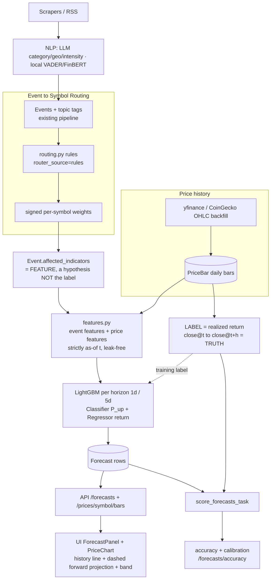
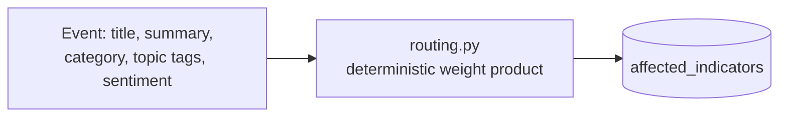
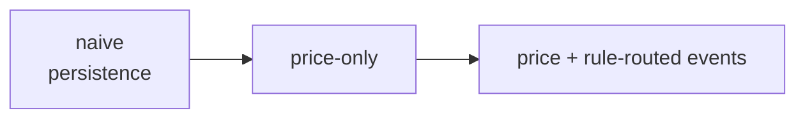

# Forecasting — event-fused symbol prediction

> The prediction layer forecasts the **direction and magnitude** of the
> market-indicator panel by fusing real-world **news events** with **price time-series** —
> framed as honest, leakage-free supervised learning, not a trading system.

## The core idea (read this first)

The pipeline has one easy-to-misread step. Spelling it out:

- The **event→symbol router** says *"this event should push GC=F up, ^VIX up …"* with a signed
  weight. **That is an input FEATURE — a hypothesis — not the answer.**
- The **label** (the supervised truth) is what the price **actually did**: the realized return
  between two real price nodes, `close@t → close@t+horizon`, from `PriceBar`.
- The ML model learns whether — and how much — the event signal actually predicts the symbol.
  The backtest's job is to prove (or honestly disprove) that the events add value.



## Indicator panel (prediction targets)

The prediction panel is **DB-driven and configurable**: the source of truth is
`MarketSymbol.is_forecast=True` (see [symbols.md](symbols.md)), read at runtime via
`services.forecasting.routing.get_panel_symbols()`. The seeded default is the **5 base
symbols**: `CL=F` (Oil), `GC=F` (Gold), `BTC-USD` (Bitcoin), `SPY`, `EURUSD=X` (EUR/USD).
`PANEL_SYMBOLS` in `routing.py` is now only a fallback used when the table is empty.
Horizons: **1 trading day** and **5 trading days**.

The deterministic router intersects every emitted symbol with the live panel, so rules
never emit a non-panel symbol. **Changing the `is_forecast` set requires a retrain** —
the next daily `train_forecast_model_task` rebuilds the model over the new panel
automatically (feature columns are one-hot over `get_panel_symbols()`).

## Moving parts

### 1. Event → symbol routing
One deterministic source (`settings.FORECAST_ROUTER = 'rules'` — a constant, tagged onto
`Event`/`Forecast.router_source`), producing
`Event.affected_indicators = [{symbol, weight(signed -1..1)}]`:



- **Rules** (`services/forecasting/routing.py`): deterministic, auditable weight =
  `sub_category_affinity × symbol_affinity × country_risk × asymmetric_sentiment`. This is the
  only router — no LLM call, no rate limits, fully reproducible. `services/routing/__init__.py`
  is a thin wrapper that calls it and persists `Event.affected_indicators`
  (`route_events()`), used by the `aggregate` and `route` pipeline stages
  (see [pipeline.md](pipeline.md)).

### 2. Price history — `PriceBar`
Daily OHLC backfilled via **yfinance** for all symbols (BTC-USD/ETH-USD resolve natively),
with **CoinGecko** as a crypto fallback when yfinance returns nothing — distinct from the
high-frequency `PriceTick` stream. Seeds both the chart and the training/label data.

### 3. Features — `services/forecasting/features.py` (leak-free, as-of `t`)
One row per `(symbol, date)`. **No data dated after `t` may enter the row** — events cut on
`Event.latest_article_at`, bars on `PriceBar.date`.

| Group | Examples |
|-------|----------|
| Price | 1d/5d/20d log returns, 20d realized vol, momentum (close/SMA20−1), RSI, volume z-score |
| Event — routed | per-symbol signed-weight sum (1d/3d/7d), max abs weight, decayed sum, touch count |
| Event — sentiment | mean/min `avg_finbert_sentiment`, `avg_sentiment` of touching events |
| Event — taxonomy | category one-hots/counts (conflict/economic/political/disaster/health) |
| Event — **tagged topics** | presence/confidence for high-signal `topic_slugs` (ukraine-war, fed-rates, inflation, opec, us-china-trade, crypto …) — the most curated signal |
| Identity | symbol (native LightGBM categorical) |

### 4. Model — `services/forecasting/model.py`
Per horizon, **two pooled LightGBM models**:
- `LGBMClassifier` → `P(up)`, isotonic-**calibrated** (`CalibratedClassifierCV`) → `direction`.
- `LGBMRegressor` → `predicted_change_pct` (realized-return target) → `predicted_price` and the
  chart's forward projection + confidence band.

Artifacts persist per horizon under `FORECAST_MODEL_DIR` (`model_h1.joblib`, `model_h5.joblib`),
loaded lazily + cached (mirrors `get_clusterer()`).

### 5. Backtest — `services/forecasting/backtest.py` (the gradeable deliverable)
Walk-forward / rolling-origin, retrain on `[.., t]`, predict `t+h`, never peek past `t`.
**Three ablation arms** prove the event signal's value:



Metrics: directional accuracy, macro-F1, ROC-AUC, **Brier + reliability curve**, vs. baselines.
A built-in self-check asserts every feature row's max event/bar date ≤ as-of date (no leakage).
Report written to `forecast_backtest_<ts>.json`.

### UI

A dedicated **Markets** tab (`/markets`, `ui/src/pages/markets.tsx`) surfaces the layer:
live `PriceTicker`, the `ForecastPanel` (1d/5d toggle, direction/P(up)/Δ%, accuracy badge,
expandable `ForecastChart` with the forward projection + band), and **`EventsHeatmap`** — a
weighted category×symbol heatmap of recent `Event.affected_indicators` (green = net upward
pressure, red = downward) plus a most-impacted-indicators ranking. The Map tab (`/`) is the
event map; clicking an event's affected-indicator chip cross-links to `/markets?symbol=…`.

### 6. Scoring — `score_forecasts_task`
Once a horizon elapses, fill `realized_direction`/`realized_change_pct`/`is_correct` from the
realized `PriceBar` close; surfaced at `/api/forecasts/accuracy/`.

## Data model

| Model | Key fields |
|-------|-----------|
| `PriceBar` | `symbol, stream_key, name, interval, open, high, low, close, volume, date` |
| `Forecast` | `symbol, stream_key, generated_at, as_of_date, horizon_days, direction, proba_up, predicted_change_pct, predicted_price, band_low, band_high, confidence, router_source, model_version, realized_direction, realized_change_pct, is_correct, scored_at` |

## Commands

```bash
python manage.py backfill_prices --years 5             # seed PriceBar (yfinance, CoinGecko crypto fallback)
python manage.py route_events --hours 168              # (re)route recent events (deterministic rules)
python manage.py train_forecast                        # fit clf+reg for both horizons
python manage.py run_forecast                          # write today's Forecast rows
python manage.py evaluate_forecast                     # walk-forward backtest → JSON report
python manage.py forecast_e2e --years 3 --backtest    # run the whole flow → JSON report
python manage.py evaluate_forecasting                 # capstone eval: routing Precision@k + return MAE → eval/*.json
python manage.py evaluate_freshness                   # capstone eval: fetch→map latency P50/P95/P99
```

`backfill_prices --dry-run` is useful for checking coverage. `forecast_e2e` chains
backfill→route→train→run→score (+ optional backtest) and writes a per-stage JSON report
(mirrors `e2e_pipeline`). `evaluate_forecasting` (`services/forecasting/evaluate.py`) adds the
two capstone headline numbers on top of the backtest: routing **Precision@k** of the rule
router's top-k `affected_indicators` vs realized ±1σ next-bar moves (reported against the
pooled random-routing base rate), and walk-forward **24h return MAE** vs the zero-return
baseline. Event time is always `Event.latest_article_at`.

## Testing

```bash
# Dependency-light self-tests — no Mongo needed. The ORM loaders are monkeypatched with
# synthetic data so the REAL feature/model/backtest code paths (incl. the as-of/leakage
# logic) are exercised. Skips the LightGBM roundtrip cleanly if lightgbm isn't installed.
DJANGO_SETTINGS_MODULE=settings.base python -m tests.tests_forecast
python -m tests.tests_forecasting_routing    # deterministic router unit tests
python -m tests.tests_forecast_evaluate      # capstone evaluation unit tests
```

`tests/tests_forecast.py` covers: `to_utc_ts` tz handling, metric correctness, **as-of
leakage** (a future-dated event must not change the as-of feature row), forward-looking labels
with non-leaking features, and the full train→predict roundtrip.

**Evaluation status:** the evaluation suite (`evaluate_forecast` backtest,
`evaluate_forecasting` capstone report) is implemented; final numbers are **to be determined**
by running it where production MongoDB is reachable. Reports land as JSON under `eval/` at the
repo root.

## Environment variables

| Variable | Default | Used by |
|----------|---------|---------|
| `FORECAST_ENABLED` | `true` | gates train/run/score tasks + schedule |
| `FORECAST_MODEL_DIR` | `/app/forecast_models` | model artifacts |
| `FORECAST_HORIZONS_DAYS` | `1,5` | horizons trained/served |
| `FORECAST_TRAIN_WINDOW_DAYS` | `540` | training lookback |
| `FORECAST_ROUTER` | `rules` | constant in `settings/base.py` (not env) — provenance tag on `router_source` |

## Honest caveats (for the write-up & defense)

1. **News is lagged and largely priced-in** — research-grade signal, not alpha.
2. **Leakage is the main threat** — strict as-of cuts on `latest_article_at`/`date`, enforced by
   a backtest self-check.
3. **Baseline first** — report directional accuracy next to the naive baseline; beating it by a
   few points (with significance) is the honest positive result. Frame as direction/volatility,
   not price-level prediction.
4. **Routing is deterministic, not LLM-driven** — `routing.py`'s rule-based weight
   product is the only router (`FORECAST_ROUTER='rules'`); there is no LLM
   routing path to fall back to or compare against.

## Key files

| File | Responsibility |
|------|----------------|
| `services/forecasting/routing.py` | deterministic event→symbol weights |
| `services/routing/__init__.py` | persists `Event.affected_indicators` from `forecasting/routing.py` |
| `services/forecasting/history.py` | OHLC backfill (yfinance + CoinGecko) |
| `services/forecasting/features.py` | as-of, leak-free feature matrix |
| `services/forecasting/model.py` | LightGBM clf+reg train/predict per horizon |
| `services/forecasting/backtest.py` | walk-forward backtest, 3 ablation arms |
| `services/forecasting/evaluate.py` | capstone eval: routing Precision@k + return MAE |
| `tests/tests_forecast.py` | dependency-light self-tests (leakage, roundtrip) |
| `core/management/commands/{backfill_prices,route_events,train_forecast,run_forecast,evaluate_forecasting,evaluate_freshness}.py` | CLI |
| `tests/management/commands/{evaluate_forecast,forecast_e2e}.py` | backtest CLI + end-to-end flow runner → JSON report |
</content>
