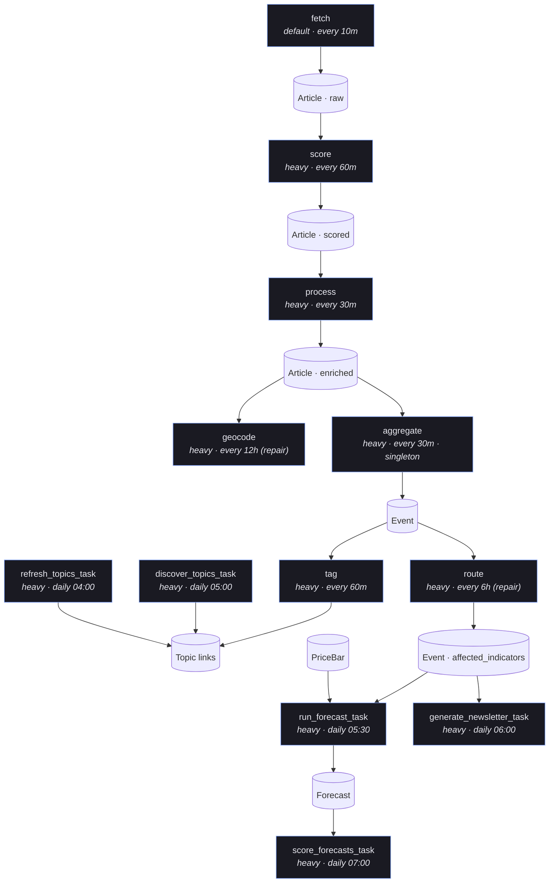
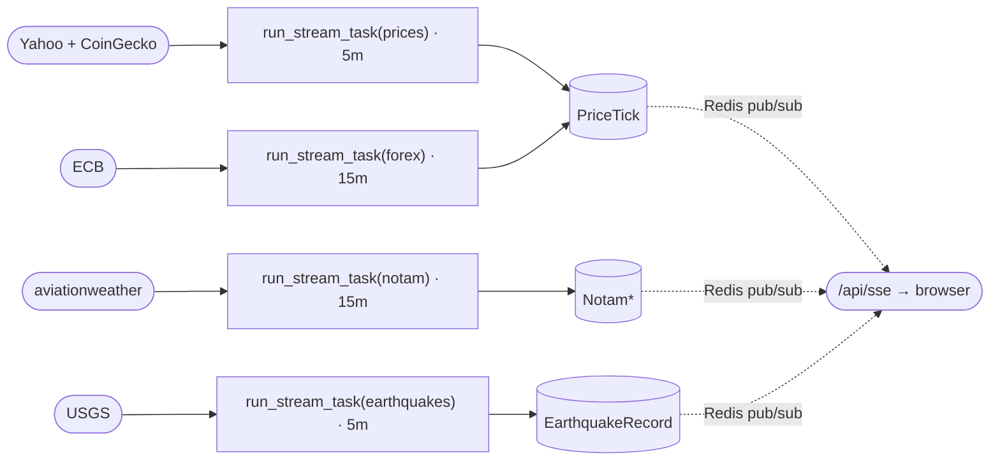

# Pipeline — stage by stage

The article→event pipeline is declared as a **stage registry**
(`api/services/stages.py`), not a set of per-step tasks. Each pull-based stage
(fetch → score → process → geocode-repair → aggregate → tag → route) declares
how to find pending work, how to process it, and its own chunk size/queue/cadence.
Exactly two Celery tasks execute every stage:

- **`pipeline_tick_task`** (cron, every 10m) — dispatches every enabled stage that
  is due (past its own `every_minutes` cadence) and has pending work.
- **`run_stage_chunk_task(stage_name, ids)`** — the only fan-out worker; runs one
  stage's handler over one chunk of ids (or a singleton run for `aggregate`).

`dispatch_stage_task(stage_name)` force-dispatches a single stage, skipping the
cadence gate — this is what the admin dashboard's per-row **Reprocess** button and
manual CLI `--background` runs use. The dashboard's coverage table, the
Reprocess button, and the tick's own selection all read the *same*
`pending_ids`/`pending_count` callables per stage, so the displayed count and
what actually gets dispatched can never drift apart.

Stages communicate only through MongoDB documents (no in-memory hand-off), are
idempotent, and are eventually-consistent: a downstream stage picks up
upstream output on its next due tick, not immediately.

> To change a stage's cadence/chunk size/queue, edit its `Stage(...)` entry in
> `services/stages.py` — not `api/crontab` (crontab only lists genuinely
> time-of-day jobs: topics, newsletter, forecasting, maintenance, health).

## Stage chain & cadences



Streams run independently on the `default` queue and feed `PriceTick` (and the SSE
channels) for the live chart; the forecaster's training/label data comes from the separate
daily `PriceBar` backfill, not the tick stream:



A stream's `fetch()`/`save()` failure propagates out of `BaseStream.run()` — a
broken stream shows up as a FAILED `TaskRun`, not as "no new records".

---

## Stage: fetch

**Goal:** get raw news into the system as `Article` documents.

- `pending_ids` = every enabled `Source`; the handler calls `fetch_source(code)`
  per source, which fetches since that source's `Source.last_fetched_at` cursor
  (clamped to a 24h floor) and advances the cursor only on success — so worker/
  cron downtime longer than the fetch interval never silently drops articles
  published during the gap.
- RSS via feedparser today; website/API adapters are the growth path.
- Historical backfill is a **separate** one-shot dispatcher
  (`backfill_history_task`), not this stage — see [operations.md](operations.md).

```bash
python manage.py fetch_data <source>              # cursor-based, same as the stage
python manage.py fetch_data <source> --hours 6     # explicit window override
python manage.py backfill_history <source> --start-date 2022-01-01 --end-date 2025-01-01 --top-n 10
```

---

## Stage: score

**Goal:** rate each unprocessed, unscored article's global significance (1.0–10.0)
so low-value articles can be filtered out before the expensive `process` stage.
**Code:** `services/scoring/` (`ArticleImportanceScorer`).

Batches of 30 titles per LLM call; applies source-weight multiplier +
cross-source corroboration bonus + category floor. Gated by
`ARTICLE_IMPORTANCE_SCORING_ENABLED`.

---

## Stage: process

**Code:** `services/processing/` (`cleaner.py` drives it; `analyzer.py`,
`vader.py`, `finbert.py` are called within, plus `services/translation/` for
Arabic). Chunks of 8 articles = one batched LLM analysis call
(`ArticleAnalyzer.ANALYZE_BATCH_SIZE`).

Per article, enrich in place:

| Field | How |
|-------|-----|
| Locations (country/city) | LLM-named, resolved to lat/lng via geonamescache |
| Category + **sub-category** | LLM, two-level taxonomy (see below) |
| Intensity | LLM-rated newsworthiness/severity [0, 1] |
| Sentiment | `Article.sentiment` — local VADER polarity [-1, 1], rule-based, no LLM call |
| Sentiment (**FinBERT**) | `Article.finbert_sentiment` — news-domain, batched, computed **once at process time** |
| i18n (en/ar) | LLM produces the English title/summary; Arabic is generated locally (MarianMT, `Helsinki-NLP/opus-mt-en-ar`) from that English text — `Article.translations` |

**Two-level category taxonomy** (`EventCategory`): top-level stays small
(`conflict, disaster, economic, political, health, general`); the LLM-produced
`sub_category` does the work (e.g. `monetary-policy`, `airstrike`, `earthquake`).
Legacy flat values (`protest`, `crime`) still validate for old data but are never
assigned to new data.

Both sentiment scores are stored so downstream features can use either; sentiment is
always a **feature**, never the predictor.

```bash
python manage.py process_articles --limit 5              # same predicate the stage uses
python manage.py process_articles --source-code <code>
python manage.py process_articles --reprocess             # re-run over already-processed rows
```

---

## Stage: geocode (repair)

Reprocesses articles that were `process`ed but ended up with no `location`
(articles not already marked `geo_failed` in `extra_data`). Runs the same NLP
pass as `process` (`only_failed=True`).

---

## Stage: aggregate

**Singleton stage** (no per-record fan-out — one `aggregate_events()` call per
tick). **Code:** `services/workflow/events.py`.

1. Bucket processed, located articles by `(city, country, category, N-day window)`.
2. Semantically sub-cluster within a bucket (`SemanticClusterer`,
   cosine ≥ 0.55, multilingual MiniLM).
3. Upsert an `Event` keyed on `(location_name, category, day)`, aggregating:
   - `avg_sentiment` (mean article sentiment), `avg_finbert_sentiment` (FinBERT mean), `avg_intensity`
   - **`latest_article_at` = max(published_on)** over constituent articles — this is
     the **event-time** used for all as-of forecasting cuts (not the day bucket).
4. Routes each event inline (`route_event_to_weighted_symbols`) — the separate
   `route` stage below is repair-only, for events that somehow missed this.

One event = many source articles. This is the "relationship between articles of the
same time/type" the system is built around.

---

## Stage: tag

**Code:** `services/workflow/topics.py::tag_events_by_ids`. Selects events whose
`topics` still need (re)tagging (empty, or previously tagged by the keyword
fallback). Chunks of 10. Uses `EmbeddingTopicMatcher` (local sentence-transformer
cosine similarity, no LLM call) → `Event.topic_slugs` + `Event.topics`. Falls back
to keyword `TopicMatcher` if the embedding model can't load or similarity scoring
fails. Re-routes `affected_indicators` once topics are known (topic routing is
higher-signal).

| Task | Cadence | Role |
|------|---------|------|
| `tag` (stage) | every 60m | Tag untagged/keyword-fallback events, chunks of 10 |
| `discover_topics_task` | daily 05:00 | LLM discovers new `Topic`s from recent events |
| `refresh_topics_task` | daily 04:00 | Scrape Wikipedia `Portal:Current_events` (last `TOPIC_SOURCES_DAYS`) → dedupe → semantic merge (≥0.85) → LLM enrich descriptions/keywords → upsert; age-off stale topics |

A **Topic** is an ongoing storyline grouping many events (e.g. "2023 Turkey–Syria
earthquakes"). `is_current` = in today's cycle; `is_active` = shown in UI;
`is_top_level` = promoted by score or pin.

---

## Stage: route (repair only)

**Not** a periodic re-route of everything recent — `aggregate` already routes
every event it touches inline. This stage only picks up events whose
`affected_indicators` is still empty (missed inline routing). Chunks of 10.

`route_event_to_weighted_symbols()` (deterministic, category/sub-category/
country/sentiment weighted rules — `services/forecasting/routing.py`) produces
`affected_indicators = [{symbol, weight}]`, the bridge between news events and
the forecasting subsystem (see [forecasting.md](forecasting.md)).

---

## Prediction (AI)

**Tasks:** `train_forecast_model_task` (daily 05:00), `run_forecast_task` (daily 05:30),
`score_forecasts_task` (daily 07:00). Fully documented in
**[forecasting.md](forecasting.md)**. In brief:

- For each `(indicator symbol, time t)` build an **as-of** feature vector from daily
  `PriceBar`s dated ≤ t and `Event`s with event-time (`latest_article_at`) ≤ t.
- Forecast output per horizon (1 day, 5 days):
  - `direction` — up / down / neutral
  - `proba_up` — calibrated probability of an upward move
  - `predicted_change_pct` — point estimate of percentage change
  - `band_low` / `band_high` — prediction interval
- **Scoring** (`score_forecasts_task`) fills `realized_direction`,
  `realized_change_pct`, and `is_correct` once the horizon closes.

---

## Streams (independent of the news pipeline)

`run_stream_task(name)` on the `default` queue; each saves to MongoDB and publishes
to a Redis SSE channel:

| Stream | Cadence | Writes | Source |
|--------|---------|--------|--------|
| `prices` | 5m | `PriceTick` | Yahoo Finance + CoinGecko (incl. **^VIX**, DX-Y.NYB) |
| `notam` | 15m | `NotamZone` (upsert) + `NotamRecord` (append) | aviationweather.gov |
| `earthquakes` | 5m | `EarthquakeRecord` | USGS FDSN |
| `forex` | 15m | `PriceTick` (`stream_key='forex'`) | ECB |

---

## Newsletter

`generate_newsletter_task` (daily 06:00) groups the day's events by category, writes
per-category LLM sections into `DailyNewsletter.body` (**Markdown**), and snapshots the
articles + cover image (idempotent). `send_newsletter` converts Markdown→HTML at send
time and delivers to confirmed subscribers via AWS SES (double opt-in; token
unsubscribe). See [`../CLAUDE.md` → Newsletter](../CLAUDE.md).

---

## Maintenance & health tasks

| Task | Cadence | Purpose |
|------|---------|---------|
| `cleanup_low_importance_articles_task` | daily 03:00 | Delete articles below `ARTICLE_MIN_IMPORTANCE` after grace period |
| `prune_stale_articles_task` | daily 03:30 | Remove old unprocessed articles |
| `adjust_source_weights_task` | weekly (Sun 02:00) | Adjust source reliability weights based on signal quality |
| `pipeline_health_task` | every 30m | Freshness/staleness report (articles, streams, current-topics, per-stage staleness); persisted to Redis and rendered on `/admin/dashboard/`'s Health section |
| `backfill_prices_task` | weekly (Sun 00:00) | Backfill daily OHLC for active symbols (bulk queue) |
</content>
