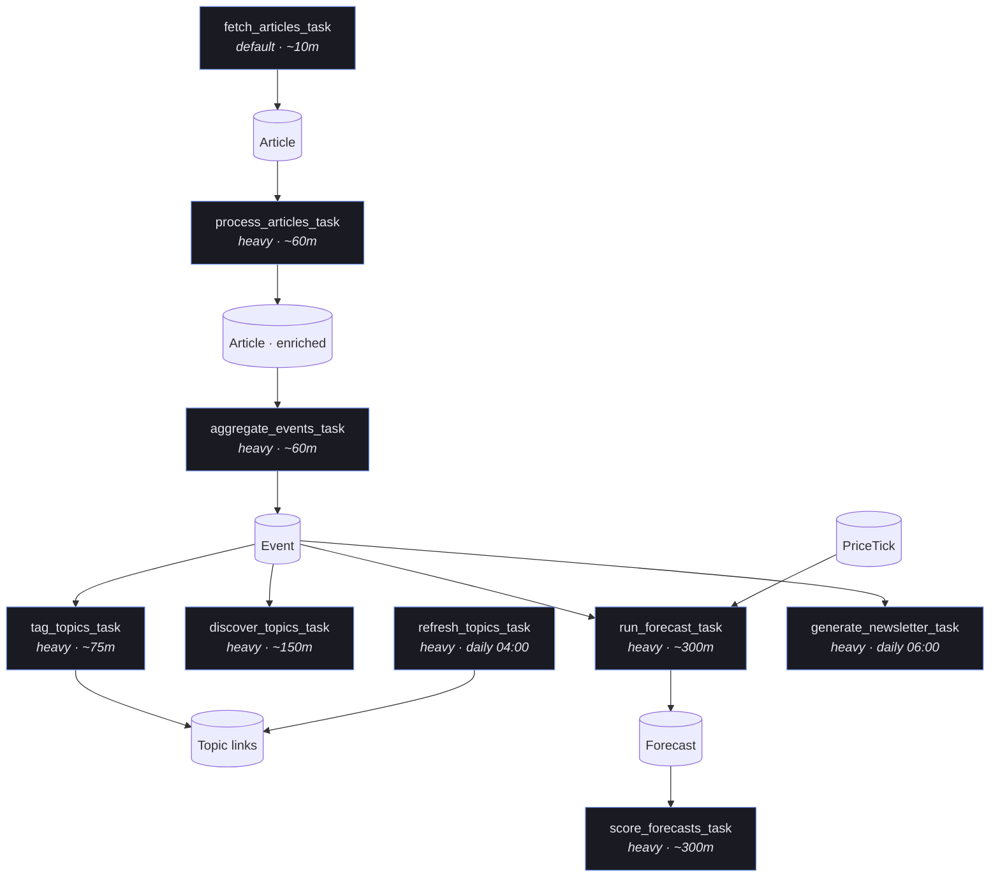
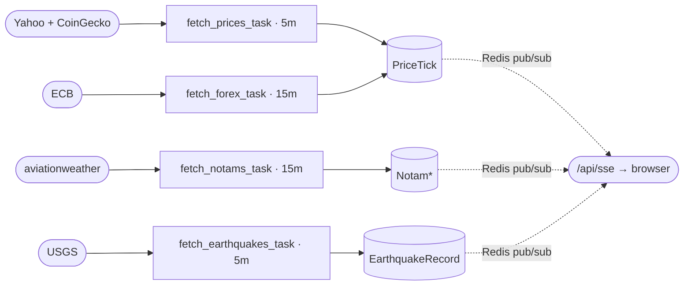

# Pipeline — phase by phase

The system is a chain of stages. Each stage has a task function in
`services/tasks.py` (plain Python, no decorator), a management command for manual
runs, and a scheduled cadence in `api/crontab`. Stages communicate
only through MongoDB documents — there is no in-memory hand-off — so any stage can be
re-run independently.

> Scheduling note: heavy-queue NLP/LLM stages run at a multiple of their base
> interval (≈5–6×). Change an interval by setting its env var and restarting the
> Periodic jobs run via supercronic in the `api` container; edit `api/crontab` to change cadence.

## Stage chain & cadences



Streams run independently on the `default` queue and feed `PriceTick` (and the SSE
channels), which the forecaster reads:



---

## Stage 1 — Fetch

**Goal:** get raw news into the system as `Article` documents.

Two modes:

### 1a. Live (`fetch_articles_task`, default queue, ~10m)
- Per enabled `Source`: pull latest items, dedupe on
  `(source_code, source_type, source_url)`, store `Article` with raw fields only
  (`title, content, url, author, source, published_on, banner_image_url`).
- RSS via feedparser today; website/API adapters are the growth path.

### 1b. Historical backfill (`backfill_history` command)
- Top-N articles **per ISO week** per source, ranked by LLM significance
  (`RSSHistoricalService`), saved idempotently. This produces the **training corpus**
  for the forecasting subsystem.
- ⚠️ **Point-in-time correctness:** ranking uses only information available *as of the
  publish week* — never present-day popularity — so no future information leaks into
  training features. The ranking signal + score are recorded on each `Article` so
  leakage is auditable.

```bash
python manage.py fetch_data <source> --hours 6
python manage.py backfill_history <source> --start-date 2022-01-01 --end-date 2025-01-01 --top-n 10
```

---

## Stage 2 — Process articles

**Task:** `process_articles_task` (heavy queue, ~60m). **Code:**
`services/processing/` (`cleaner.py` drives it; `analyzer.py`, `finbert.py` are
called within).

Per article, enrich in place:

| Field | How |
|-------|-----|
| Entities / locations | LLM entities + geonamescache geocode |
| Category + **sub-category** | LLM, two-level taxonomy (see below) |
| Sentiment | `Article.sentiment` — LLM-extracted polarity [-1, 1] |
| Sentiment (**FinBERT**) | `Article.finbert_sentiment` — news-domain, batched on the heavy queue, computed **once at process time** |
| i18n (en/ar) | LLM translations → `Article.translations` |

**Two-level category taxonomy** (`EventCategory`): top-level stays small
(`conflict, disaster, economic, political, health, general`); the LLM-produced
`sub_category` does the work (e.g. `monetary-policy`, `airstrike`, `earthquake`).
Legacy flat values (`protest`, `crime`) still validate for old data but are never
assigned to new data.

Both sentiment scores are stored so downstream features can use either; sentiment is
always a **feature**, never the predictor.

---

## Stage 2b — Aggregate into events

**Task:** `aggregate_events_task` (heavy queue, ~60m). **Code:** `services/workflow.py`.

1. Bucket processed articles by `(city, country, category, day)`.
2. Semantically sub-cluster within a bucket (`SemanticClusterer`,
   cosine ≥ 0.55, multilingual MiniLM).
3. Upsert an `Event` keyed on `(location_name, category, day)`, aggregating:
   - `avg_sentiment` (mean article sentiment), `avg_finbert_sentiment` (FinBERT mean), `avg_intensity`
   - **`latest_article_at` = max(published_on)** over constituent articles — this is
     the **event-time** used for all as-of forecasting cuts (not the day bucket).
   - **`affected_indicators`** = `route_event_to_weighted_symbols(...)` — a
     deterministic list of `{symbol, weight}` (see [forecasting.md](forecasting.md)).

One event = many source articles. This is the "relationship between articles of the
same time/type" the system is built around.

---

## Stage 2c — Topic tagging & discovery

| Task | Cadence | Role |
|------|---------|------|
| `tag_topics_task` | ~75m | `LLMTopicMatcher` (batch 10 events/call) → `Event.topic_slugs` + `Event.topics`. Re-routes `affected_indicators` once topics are known (topic routing is higher-signal). Falls back to keyword `TopicMatcher` on LLM error. |
| `discover_topics_task` | ~150m | LLM discovers new `Topic`s from recent events. |
| `refresh_topics_task` | daily 04:00 | Scrape Wikipedia `Portal:Current_events` (last `TOPIC_SOURCES_DAYS`) → dedupe → semantic merge (≥0.85) → LLM enrich descriptions/keywords → upsert; age-off stale topics. |

A **Topic** is an ongoing storyline grouping many events (e.g. "2023 Turkey–Syria
earthquakes"). `is_current` = in today's cycle; `is_active` = shown in UI;
`is_top_level` = promoted by score or pin.

---

## Stage 3 — Prediction (AI)

**Tasks:** `run_forecast_task` + `score_forecasts_task` (~300m), `train_forecaster_task`
(daily). Fully documented in **[forecasting.md](forecasting.md)**. In brief:

- For each `(indicator symbol, time t)` build an **as-of, volume-normalized** feature
  vector from `PriceTick`s ≤ t and `Event`s with event-time ≤ t.
- Predict **two heads per horizon** (1h crypto-only, 1d, 1w):
  `magnitude_bucket` (5-class direction) and `volatility_bucket` (3-class vol regime).
- **v1** = LLM decision-support (emits reliability, may **abstain**, calibrated).
  **v2** = LightGBM, the primary predictor, trained walk-forward.
- **Scoring** snaps the target to the next trading-session close, computes the
  realized return/vol, classifies it against the *same* as-of thresholds stored on the
  forecast, and reports metrics vs naive baselines.

---

## Streams (independent of the news pipeline)

Default queue; each saves to MongoDB and publishes to a Redis SSE channel:

| Task | Cadence | Writes | Source |
|------|---------|--------|--------|
| `fetch_prices_task` | 5m | `PriceTick` | Yahoo Finance + CoinGecko (incl. **^VIX**, DX-Y.NYB) |
| `fetch_notams_task` | 15m | `NotamZone` (upsert) + `NotamRecord` (append) | aviationweather.gov |
| `fetch_earthquakes_task` | 5m | `EarthquakeRecord` | USGS FDSN |
| `fetch_forex_task` | 15m | `PriceTick` (`stream_key='forex'`) | ECB |

---

## Stage 4 — Newsletter

`generate_newsletter_task` (daily 06:00) groups the day's events by category, writes
per-category LLM sections into `DailyNewsletter.body` (**Markdown**), and snapshots the
articles + cover image (idempotent). `send_newsletter` converts Markdown→HTML at send
time and delivers to confirmed subscribers via AWS SES (double opt-in; token
unsubscribe). See [`../CLAUDE.md` → Newsletter](../CLAUDE.md).
</content>
