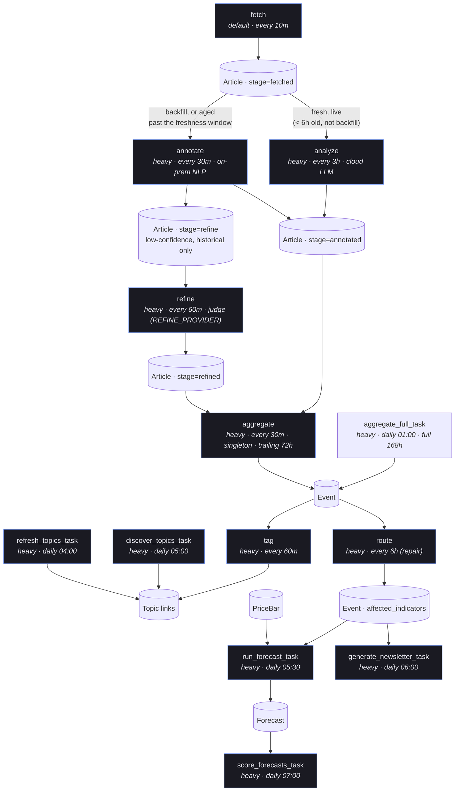
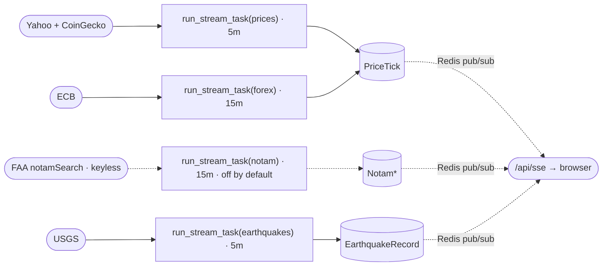

# Pipeline — stage by stage

The article→event pipeline is declared as a **stage registry**
(`api/services/stages.py`), not a set of per-step tasks. Each pull-based stage
(fetch → {analyze | annotate → refine} → aggregate → tag → route) declares
how to find pending work, how to process it, and its own chunk size/queue/cadence.
`analyze` and `annotate` both select from `stage='fetched'` but partition
disjointly by recency (see [Stage: analyze](#stage-analyze)), so every fetched
article lands in exactly one of them. Exactly two Celery tasks execute every stage:

- **`pipeline_tick_task`** (cron, every 10m) — dispatches every enabled stage that
  is due (past its own `every_minutes` cadence) and has pending work.
- **`run_stage_chunk_task(stage_name, ids)`** — the only fan-out worker; runs one
  stage's handler over one chunk of ids (or a singleton run for `aggregate`).

`dispatch_stage_task(stage_name)` force-dispatches a single stage, skipping the
cadence gate — this is what the admin dashboard's per-row **Reprocess** button and
manual CLI `--background` runs use. The dashboard's coverage table, the
Reprocess button, and the tick's own selection all read the *same*
`pending_ids`/`pending_count` callables per stage, so the displayed count and
what actually gets dispatched can never drift apart.

Stages communicate only through MongoDB documents (no in-memory hand-off), are
idempotent, and are eventually-consistent: a downstream stage picks up
upstream output on its next due tick, not immediately.

> To change a stage's cadence/chunk size/queue, edit its `Stage(...)` entry in
> `services/stages.py` — not `api/crontab` (crontab only lists genuinely
> time-of-day jobs: topics, newsletter, forecasting, maintenance, health).

## Stage chain & cadences



Streams run independently on the `default` queue and feed `PriceTick` (and the SSE
channels) for the live chart; the forecaster's training/label data comes from the separate
daily `PriceBar` backfill, not the tick stream:



A stream's `fetch()`/`save()` failure propagates out of `BaseStream.run()` — a
broken stream shows up as a FAILED `TaskRun`, not as "no new records".

---

## Stage: fetch

**Goal:** get raw news into the system as `Article` documents.

- `pending_ids` = every enabled `Source`; the handler calls `fetch_source(code)`
  per source, which fetches since that source's `Source.last_fetched_at` cursor
  (clamped to a 24h floor) and advances the cursor only on success — so worker/
  cron downtime longer than the fetch interval never silently drops articles
  published during the gap.
- RSS via feedparser today; website/API adapters are the growth path.
- **Body extraction** (`services/data/bodies.py`) runs trafilatura first — a
  maintained main-content extractor that strips nav/share-bars/subscription
  chrome — with the old regex pass as a fallback; a subscription-wall body is
  dropped so callers fall back to Wayback or the paywall-free RSS summary.
- Historical backfill is a **separate** one-shot dispatcher
  (`backfill_history_task`), not this stage — see [operations.md](operations.md).
  Sitemap discovery skips non-article URLs up front (`is_non_article_url`:
  tag/category/author/staff/advisor indexes, image-asset slugs, homepages).

```bash
python manage.py fetch_data <source>              # cursor-based, same as the stage
python manage.py fetch_data <source> --hours 6     # explicit window override
python manage.py backfill_history <source> --start-date 2022-01-01 --end-date 2025-01-01 --top-n 10
```

---

## Stage: analyze

**Goal:** the higher-quality path — full cloud-LLM analysis for articles that
were *just* fetched. **Code:** `services/processing/analyzer.py`
(`ArticleAnalyzer`) via `services.workflow.articles.analyze_live_articles`,
same `LLM_ROUTES['analyzer_lite']` provider chain the refine stage's `cloud`
provider uses. Chunks of 8 (`ArticleAnalyzer.ANALYZE_BATCH_SIZE`) = one
batched LLM call.

**Why live-only:** cloud LLM cost/rate-limits don't scale to the full
historical corpus (that's exactly why the `annotate`/`refine` on-prem path
exists), but live volume — a trickle every 10 minutes from `fetch` — comfortably
fits inside free-tier limits, and the extra judgment quality is worth spending
on articles that are actually going to be shown live.

**Selection:** `stage='fetched'`, not backfill-tagged (`extra_data.backfill_day`
unset), and `created_on` within `LIVE_ANALYZE_FRESHNESS_HOURS` (`services/
stages.py`, default 6h — 2× the stage's own 3h cadence, so one missed tick
doesn't strand anything). Gated by `LIVE_LLM_ENABLED` (dashboard toggle).

**Fallback, not a failure mode:** an article this stage doesn't reach in
time — LLM outage, `LIVE_LLM_ENABLED` off, or simply not fetched recently
enough — automatically falls through to `annotate` once it ages past the
freshness window, since `annotate`'s own selection is "everything `analyze`
doesn't claim" (backfill-tagged, or aged out). A live article is therefore
never stranded by the LLM path being unavailable; it only ever degrades from
"analyzed by the cloud LLM" to "analyzed for free on-prem", never to
"unanalyzed".

Produces the same fields `annotate` does — `category`, `sub_category`,
`location`/`latitude`/`longitude`, `event_intensity`, `translations.en`
(here: an *abstractive* LLM summary, vs. `annotate`'s extractive one) — plus
the same local `sentiment`/`finbert_sentiment`/Arabic-translation/importance
pipeline `annotate` uses (these are backend-agnostic; only the source of
category/geo/intensity/summary changes). Terminal on success:
`stage='annotated'` — the *same* value `annotate` uses, so `aggregate`/`tag`/
`route` and the public API never need to know which analyzer produced a given
article. A failed analysis leaves `stage='fetched'` unchanged, for this stage
to retry on its next tick or for the fallback above to eventually claim.

```bash
python manage.py run_task dispatch_stage_task stage_name=analyze --sync
```

---

## Stage: annotate

**Goal:** every on-prem annotation in one pass — classification, geo, intensity,
sentiment, importance, translations. No LLM anywhere; every model is a
pretrained download, so the stage works from an empty database with no keys.
Handles all historical/backfill volume (cheap, no rate limits) plus any live
article the `analyze` stage above didn't reach in time.
**Code:** `services/processing/annotator.py` (`NLPAnnotator`), taxonomy data in
`taxonomy.py`, gazetteer in `geocode.py`, importance post-processing in
`services/scoring/`. Chunks of 8; per-article handling, so one bad article can
never fail its chunk.

Before spending NLP, the pass **quarantines structural junk** (non-article
pages, raw-URL/paywall stubs — `is_junk_article`): the row is soft-deleted
(`is_deleted=True`, hidden by the default manager, see
[data-model.md](data-model.md)) and stamped `processed_on`, kept as training
data but excluded everywhere. Nothing hard-deletes.

Per article, enrich in place:

| Field | How |
|-------|-----|
| **Category** | zero-shot NLI entailment — "what the story is *about*" — via the single fast `deberta-v3-base-zeroshot-v2.0` (`refiner.classify_zeroshot(single=True)`), with post-hoc evidence gates; the entailment confidence also decides the article's next stage |
| **Sub-category** | nearest taxonomy prototype by embedding cosine (shared MiniLM) *within* the chosen category (`best_sub`), so a sub prototype can never drag in the wrong parent category |
| Locations (country/city → lat/lng) | pretrained NER (`wikineural`) → gazetteer + aliases + country-of-city backfill; regex country-scan fallback |
| Intensity | taxonomy prior + lexical severity cues (casualties, quake magnitude, escalation vocabulary) |
| Importance (1.0–10.0) | intensity mapped to a 1–10 base, then source-weight multiplier + cross-source corroboration bonus + category floor |
| Sentiment | `Article.sentiment` — local VADER polarity [-1, 1] |
| Sentiment (**FinBERT**) | `Article.finbert_sentiment` — news-domain, batched, computed **once at annotate time** |
| i18n (en/ar) | extractive English summary (leading sentences); Arabic generated locally (MarianMT) — skipped for lite/backfill articles |

**Stage transition:** confident classification → `stage='annotated'` (terminal);
entailment confidence below `ESCALATE_BELOW` → `stage='refine'`, queueing the
article for the judge below. A *failed* annotation leaves `stage='fetched'` and
is retried — no repair loop.

**Two-level category taxonomy** (`EventCategory`): top-level stays small
(`conflict, disaster, economic, political, health, general`); `sub_category`
does the work (e.g. `monetary-policy`, `airstrike`, `earthquake`). Category
decision lives in `refiner.py` (`classify_zeroshot`: the NLI hypothesis labels
in `_ZEROSHOT_LABELS` + the evidence gates in `_apply_category_gates`); the
sub-category prototype sentences and intensity priors live in `taxonomy.py`.
Tuning is a data edit — new hypothesis labels or prototypes, not a code change.

```bash
python manage.py process_articles --limit 5              # same predicate the stage uses
python manage.py process_articles --source-code <code>
python manage.py process_articles --reprocess             # re-run over already-annotated rows
python manage.py eval_analyzer --limit 30 [--refine]      # live-sample eval report (results/eval_analyzer/)
```

Geocoding is **not a separate stage** — it happens inline (a local
`geonamescache` lookup in `services/processing/geocode.py`). An annotated
article that resolves no location is terminal (it simply never aggregates into
an event).

---

## Stage: refine

**Goal:** a second opinion on the articles the annotate stage was unsure about
(`stage='refine'`), re-judging category/sub-category — and, for LLM providers,
geo/intensity/summary. **Code:** `services/processing/refiner.py`
(`LLMRefiner`).

One judge per deployment via `REFINE_PROVIDER`, each batched to its capacity:

| Provider | What it is | Batch |
|----------|------------|-------|
| `zeroshot` (default) | mDeBERTa zero-shot NLI, on-prem; conflict-verdicts require concrete military/violence vocabulary (metaphor gate) | 16 |
| `ollama` | local LLM (`ollama_medium`), JSON-schema constrained decoding — output cannot fail to parse | 1 |
| `cloud` | the LLM prompt client (`analyzer.py`) via `LLM_ROUTES['analyzer_lite']`; also refreshes the abstractive EN summary | 8 |
| `off` | stage never dispatches; flagged articles keep their prototype annotations | — |

A verdict advances the article to `stage='refined'` (+ `refined_on`); a failed/
unavailable judge leaves `stage='refine'` for retry. The LLM master switch
(dashboard) gates this stage only when the provider is an actual LLM.

---

## Stage: aggregate

**Singleton stage** (no per-record fan-out — one `aggregate_events()` call per
tick). **Code:** `services/workflow/events.py`.

The 30-min stage clusters only the trailing `AGGREGATE_LIVE_WINDOW_HOURS` (72h) so
each tick doesn't re-cluster a full week; `aggregate_full_task` (daily 01:00) re-runs
`aggregate_events()` over the full 168h (`EVENT_STAGE_WINDOW_HOURS`) to catch
multi-day events that age past the live window. `aggregate_events()` is idempotent
(upsert keyed on `(location_name, category, day)`), so the two safely overlap.

1. Bucket processed, located articles by `(city, country, category, N-day window)`.
2. Semantically sub-cluster within a bucket (`SemanticClusterer`,
   cosine ≥ 0.55, multilingual MiniLM).
3. Upsert an `Event` keyed on `(location_name, category, day)`, aggregating:
   - `avg_sentiment` (mean article sentiment), `avg_finbert_sentiment` (FinBERT mean), `avg_intensity`
   - **`latest_article_at` = max(published_on)** over constituent articles — this is
     the **event-time** used for all as-of forecasting cuts (not the day bucket).
4. Routes each event inline (`route_event_to_weighted_symbols`) — the separate
   `route` stage below is repair-only, for events that somehow missed this.

One event = many source articles. This is the "relationship between articles of the
same time/type" the system is built around.

---

## Stage: tag

**Code:** `services/workflow/topics.py::tag_events_by_ids`. Selects events whose
`topics` still need (re)tagging (empty, or previously tagged by the keyword
fallback). Chunks of 10. Uses `EmbeddingTopicMatcher` (local sentence-transformer
cosine similarity, no LLM call) → `Event.topic_slugs` + `Event.topics`. Falls back
to keyword `TopicMatcher` if the embedding model can't load or similarity scoring
fails. Re-routes `affected_indicators` once topics are known (topic routing is
higher-signal).

| Task | Cadence | Role |
|------|---------|------|
| `tag` (stage) | every 60m | Tag untagged/keyword-fallback events, chunks of 10 |
| `discover_topics_task` | daily 05:00 | LLM discovers new `Topic`s from recent events |
| `refresh_topics_task` | daily 04:00 | Scrape Wikipedia `Portal:Current_events` (last `TOPIC_SOURCES_DAYS`) → dedupe → semantic merge (≥0.85) → LLM enrich descriptions/keywords → upsert; age-off stale topics |

A **Topic** is an ongoing storyline grouping many events (e.g. "2023 Turkey–Syria
earthquakes"). `is_current` = in today's cycle; `is_active` = shown in UI;
`is_top_level` = promoted by score or pin.

---

## Stage: route (repair only)

**Not** a periodic re-route of everything recent — `aggregate` already routes
every event it touches inline. This stage only picks up events whose
`affected_indicators` is still empty (missed inline routing). Chunks of 10.

`route_event_to_weighted_symbols()` (deterministic, category/sub-category/
country/sentiment weighted rules — `services/forecasting/routing.py`) produces
`affected_indicators = [{symbol, weight}]`, the bridge between news events and
the forecasting subsystem (see [forecasting.md](forecasting.md)).

---

## Prediction (AI)

**Tasks:** `train_forecast_model_task` (daily 05:00), `run_forecast_task` (daily 05:30),
`score_forecasts_task` (daily 07:00). Fully documented in
**[forecasting.md](forecasting.md)**. In brief:

- For each `(indicator symbol, time t)` build an **as-of** feature vector from daily
  `PriceBar`s dated ≤ t and `Event`s with event-time (`latest_article_at`) ≤ t.
- Forecast output per horizon (1 day, 5 days):
  - `direction` — up / down / neutral
  - `proba_up` — calibrated probability of an upward move
  - `predicted_change_pct` — point estimate of percentage change
  - `band_low` / `band_high` — prediction interval
- **Scoring** (`score_forecasts_task`) fills `realized_direction`,
  `realized_change_pct`, and `is_correct` once the horizon closes.

---

## Streams (independent of the news pipeline)

`run_stream_task(name)` on the `default` queue; each saves to MongoDB and publishes
to a Redis SSE channel:

| Stream | Cadence | Writes | Source |
|--------|---------|--------|--------|
| `prices` | 5m | `PriceTick` | Yahoo Finance + CoinGecko (incl. **^VIX**, DX-Y.NYB) |
| `notam` | 15m | `NotamZone` (upsert) + `NotamRecord` (append) | FAA `notamSearch` (keyless — polls curated world airports, coords from ICAO Q-line). **Off by default** (`STREAM_NOTAM_ENABLED=False`): the endpoint is behind Akamai and bot-blocks bursty/low-reputation IPs, so opt in from a stable server IP and watch its `TaskRun`s |
| `earthquakes` | 5m | `EarthquakeRecord` | USGS FDSN |
| `forex` | 15m | `PriceTick` (`stream_key='forex'`) | ECB |

---

## Newsletter

`generate_newsletter_task` (daily 06:00) groups the day's events by category, writes
per-category LLM sections into `DailyNewsletter.body` (**Markdown**), and snapshots the
articles + cover image (idempotent). `send_newsletter` converts Markdown→HTML at send
time and delivers to confirmed subscribers via AWS SES (double opt-in; token
unsubscribe). See [`../CLAUDE.md` → Newsletter](../CLAUDE.md).

---

## Maintenance & health tasks

Article records are never deleted — every article is kept as training/distillation
data, so there are no cleanup/prune tasks.

| Task | Cadence | Purpose |
|------|---------|---------|
| `adjust_source_weights_task` | weekly (Sun 02:00) | Adjust source reliability weights based on signal quality |
| `pipeline_health_task` | every 30m | Freshness/staleness report (articles, streams, current-topics, per-stage staleness); persisted to Redis and rendered on `/admin/dashboard/`'s Health section |
| `backfill_prices_task` | weekly (Sun 00:00) | Backfill daily OHLC for active symbols (bulk queue) |
</content>
